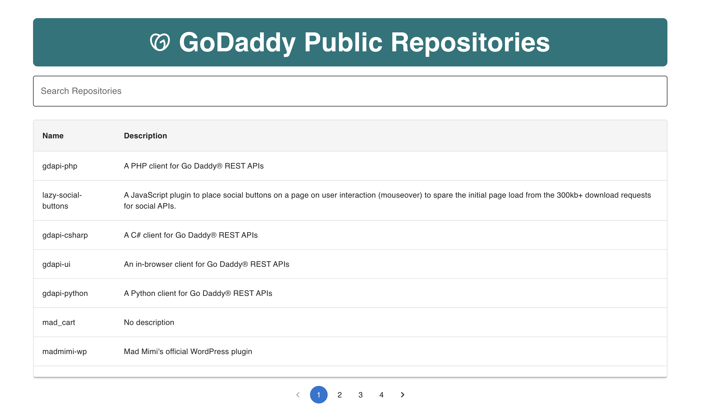
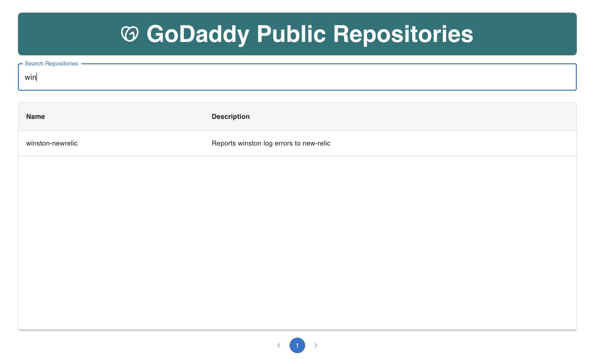
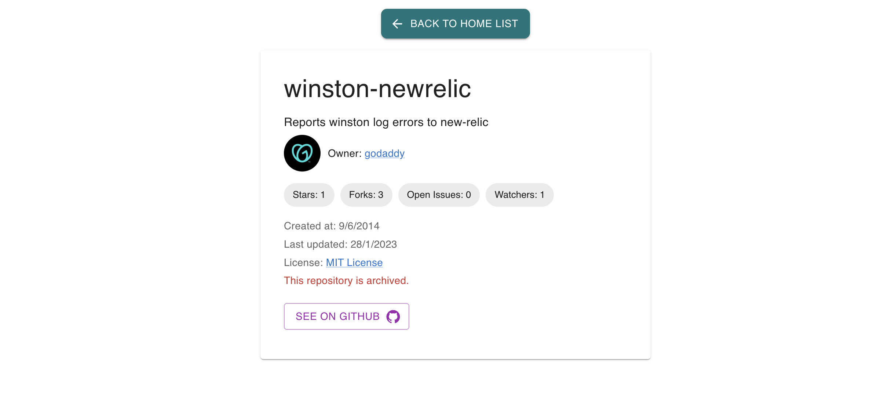

# GoDaddy Public Repositories

This project is a web application that displays GoDaddy's public repositories using React, TypeScript, and Vite. The application includes features such as search, pagination, and repository details.

## Screenshots

### Home Page


### Search Feature


### Repository Details


## Installation

1. Clone this repository:
   ```bash
   git clone https://github.com/your-username/godaddy-public-repos.git
   cd godaddy-public-repos
   ```

2. Install dependencies:
   ```bash
   npm install
   ```

3. Start the development server:
   ```bash
   npm run dev
   ```

4. Open the application in your browser at `http://localhost:5173`.

## Available Scripts

- `npm run dev`: Starts the development server.
- `npm run build`: Builds the application for production.
- `npm run preview`: Previews the built application.
- `npm run lint`: Runs ESLint to check for code and style errors.
- `npm run test`: Runs unit tests using Vitest.

## Design Decisions

### Libraries Chosen

- **React + TypeScript**: React is a popular library for building user interfaces, and TypeScript provides static typing to improve code quality.
- **Vite**: Vite was chosen for its speed and simplicity in modern application development.
- **Material-UI (MUI)**: MUI was used to create a modern and consistent user interface with pre-built components.
- **Zustand**: Zustand was chosen for global state management due to its simplicity and flexibility.
- **Axios**: Axios was used for HTTP requests because of its intuitive API and error handling.

### Implemented Features

- **Search**: Allows filtering repositories by name or description.
- **Pagination**: Divides repositories into pages to enhance user experience.
- **Repository Details**: Displays detailed information about a selected repository.

### Limitations and Omissions

- **Testing**: While unit tests were implemented for key components, not all edge cases were covered due to time constraints.
- **Styling**: A basic design was implemented using MUI, but it could be improved with additional customizations.

## Project Structure

```
src/
├── api/               # API logic
├── components/        # Reusable components
├── constants/         # Global constants
├── pages/             # Main application pages
├── routes/            # Route configuration
├── store/             # Global state management
├── types/             # TypeScript type definitions
├── App.tsx            # Root application component
├── main.tsx           # Application entry point
```

## Next Steps

- **Internationalization**: Add support for multiple languages.
- **CI/CD**: Add Pipeline to add CI/CD and validate unit test in pipeline
- **End2End**: Add support e2e with cypress or playwright.

## ESLint Configuration

This project uses ESLint for linting. Below is an example configuration for enabling React-specific lint rules:

```js
// eslint.config.js
import reactX from 'eslint-plugin-react-x';
import reactDom from 'eslint-plugin-react-dom';

export default tseslint.config([
  globalIgnores(['dist']),
  {
    files: ['**/*.{ts,tsx}'],
    extends: [
      // Other configs...
      // Enable lint rules for React
      reactX.configs['recommended-typescript'],
      // Enable lint rules for React DOM
      reactDom.configs.recommended,
    ],
    languageOptions: {
      parserOptions: {
        project: ['./tsconfig.node.json', './tsconfig.app.json'],
        tsconfigRootDir: import.meta.dirname,
      },
      // other options...
    },
  },
]);
```

Thank you for reviewing this project! If you have any questions or suggestions, feel free to reach out.
